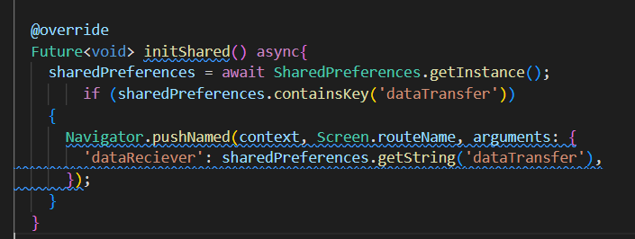
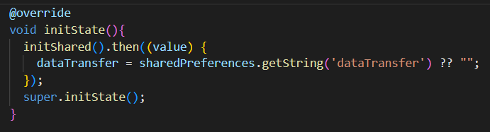
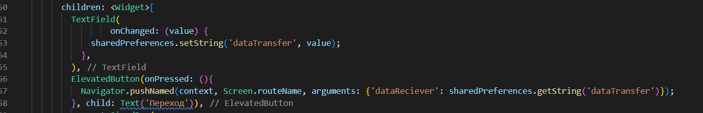
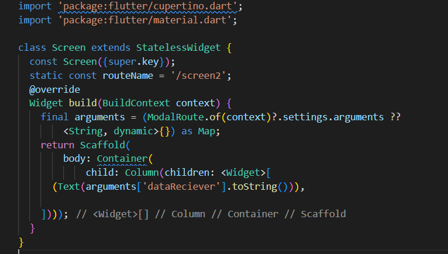
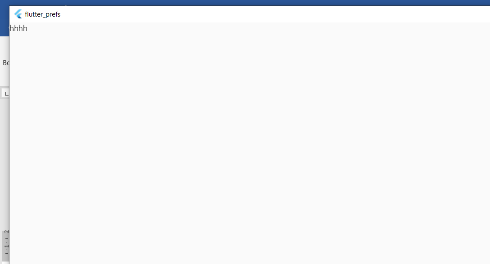

# Практическая работа №5
Передача данных
Цель работы: Реализовать передачу данных через параметр arguments и сохранение данных в SharedPrefrences.
Ход работы:
Реализуем экран, на котором будем вводить данные для передачи. Инициализируем sharedPreferences. 

Рисунок 30 – Инициализация

Инициализируем State.

Рисунок 31 - Инициализация State

Рисунок 32 - Передача данных в другое окно

Принимаем данные из первого окна.

Рисунок 33 - Приём данных

 

Рисунок 34 – Результат

Вывод: удалось реализовать передачу данных через параметр arguments и сохранение данных в SharedPrefrences.